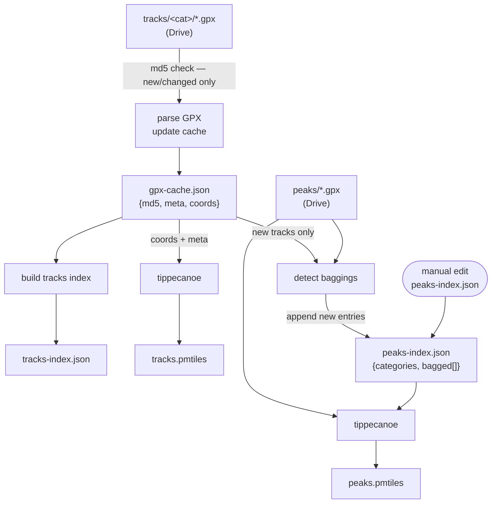

# Build Pipeline

## Dependency graph



## Tasks

| Task | Inputs | Output | Reruns when |
|---|---|---|---|
| `parse_gpx` | `tracks/**/*.gpx` | `gpx-cache.json` | any track file md5 changes |
| `build_tracks_index` | `gpx-cache.json` | `tracks-index.json` | cache changes |
| `build_tracks_pmtiles` | `gpx-cache.json` | `tracks.pmtiles` | cache changes |
| `detect_baggings` | `gpx-cache.json`, `peaks/*.gpx` | `peaks-index.json` | cache or peak files change |
| `build_peaks_pmtiles` | `peaks/*.gpx`, `peaks-index.json` | `peaks.pmtiles` | peak files or index change |

## Notes

- `gpx-cache.json` and `peaks-index.json` are a matched pair — if you delete the cache to force
  a full reparse, also clear the `bagged` array in `peaks-index.json` to avoid duplicate entries.
- Manual edits to `peaks-index.json` trigger `build_peaks_pmtiles` but not `detect_baggings`
  (correct — detection only runs for new tracks).
- `peaks-index.json` is read and written by `detect_baggings`. doit sees it only as a target;
  the existing content is read inside the action rather than declared as a file dependency.
```
