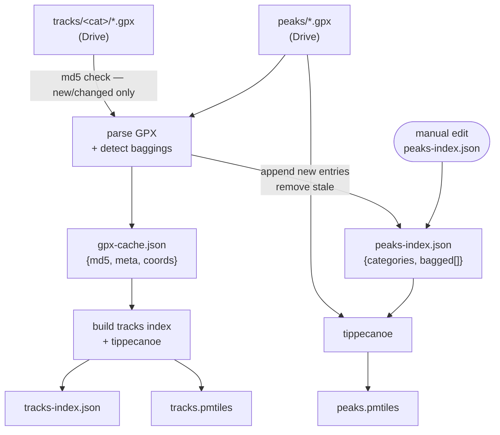

# Build Pipeline

## Dependency graph



## Tasks

| Task | Inputs | Outputs | Reruns when |
|---|---|---|---|
| `parse_and_bag_tracks` | `tracks/**/*.gpx`, `peaks/*.gpx` | `gpx-cache.json`, `peaks-index.json` | any track or peak file changes |
| `build_tracks` | `gpx-cache.json` | `tracks.pmtiles`, `tracks-index.json` | cache changes |
| `build_peaks_pmtiles` | `peaks/*.gpx`, `peaks-index.json` | `peaks.pmtiles` | peak files or index change |

## CLI (`build.py`)

```
yarn build-pmtiles [OPTIONS] [TASK ...]

--force           Delete gpx-cache.json + .doit.db (full rebuild)
--retrack PATTERN Remove matching entries from cache + .doit.db (re-parse those tracks)
--folder NAME     Drive folder name (default: DoneIt)
--bag-distance M  Peak detection radius in metres (default: 500)
--country         Annotate tracks with country name
```

**Re-bag after a peak name change or new peak added:** `yarn build-pmtiles --force`

**Re-process a single track category:** `yarn build-pmtiles --retrack 'hills/*'`

## Notes

- `gpx-cache.json` is the single record of "this track has been parsed and bagging-detected".
  Delete it (or use `--force`) to trigger a full reparse. Unlike a separate bagging log, there
  is no risk of the cache and detection state getting out of sync.
- If a track is re-processed (MD5 changed or `--retrack`), any existing bagging entries for
  that track filename are removed from `peaks-index.json` before re-detection, preventing duplicates.
- Manually editing `peaks-index.json` triggers `build_peaks_pmtiles` but not `parse_and_bag_tracks`
  (correct — detection only runs for new/changed tracks).
- PMTiles peak features carry only `name/category/ele`. Done status is derived at runtime
  by the app from `peaks-index.json`.
- Delete both `gpx-cache.json` and `.doit.db` together if you want a clean slate — doit stores
  file-dep MD5s in `.doit.db` and will consider tasks up-to-date if only one is deleted.
```
